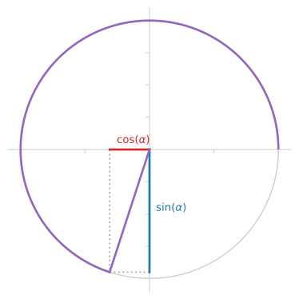

<div align="center">
<p align="center">
  <a href="https://github.com/nschloe/tau"></a>
  <p align="center">The better π</p>
</p>
</div>

> Beauty is the first test: there is no permanent place in this world for ugly
> mathematics.
>
> – [G.H. Hardy](https://en.wikipedia.org/wiki/G._H._Hardy)

In 2001, [Bob Palais](http://www.math.utah.edu/~palais/) wrote the article [_π
is wrong!_](https://doi.org/10.1007%2FBF03026846), remarking on the fact that
when π occurs in nature, it occurs as 2π most of the time. He suggests that
2π = 6.283185... should be given a name (τ is now a fan favorite) and that it
should be used instead of π. Some found his arguments convincing, including
[Michael Hartl](https://www.michaelhartl.com/). In 2010, Hartl published [The
Tau Manifesto](https://tauday.com/tau-manifesto), and the τ movement was born.

### Scientific articles and blog posts

<!--table style="width:220px" align="right">
<tr>
<td></td>
</tr>
<tr><td>
Michael Hartl (left) and Bob Palais (right) on Tau Day 2017 (Source:
<a href="https://twitter.com/tauday/status/880612180822851586">Twitter</a>).
</td></tr>
</table-->

- [Bob Palais, _π is wrong!_, 2001](https://doi.org/10.1007%2FBF03026846), The Mathematical Intelligencer, volume 23, pages 7–8
- [Bob Palais' web page](https://www.math.utah.edu/~palais/pi.html)
- [Michael Hartl, _The Tau Manifesto_, 2010](https://tauday.com/tau-manifesto).
  As paperback [on
  Amazon](https://www.amazon.de/-/en/Michael-Hartl/dp/B096CXMQ3W)
- [Joseph Lindenberg, _Tau Before It Was Cool_, 2011](https://sites.google.com/site/taubeforeitwascool/)
- [Stephen Abbott, _Aftermath: My Conversion to Tauism_, 2012](https://doi.org/10.4169%2Fmathhorizons.19.4.34), Math Horizons, 19(4), p. 34
- [Peter Harremoës, _Al-Kāshī’s constant_, 2018](http://www.harremoes.dk/Peter/Undervis/Turnpage/Turnpage1.pdf)

Articles _against_ τ:

- [The Pi Manifesto](https://archive.ph/VnJ2x)
- [The Proper π Manifesto](http://proper-pi-manifesto.com/)
- [Marc B. Reynolds, _Tau and the art of Windmill jousting_, 2020](http://marc-b-reynolds.github.io/math/2020/01/06/Tau.html)

### News articles and blog posts

<details>
<summary>Click to expand</summary>

- 2007:

  - [Bill Gasarch, _Is Pi defined in the best way?_, 2007](http://blog.computationalcomplexity.org/2007/08/is-pi-defined-in-best-way.html)

- 2008:

  - [Robert P. Crease, Physics World, _Constant failure_, 2008](https://physicsworld.com/a/constant-failure/)

- 2010:

  - [_Dozenal tau unit circle_, 2010](https://hexnet.org/content/dozenal-tau-unit-circle)

- 2011:

  - [Jason Palmer, BBC News, _'Tau day' marked by opponents of maths constant pi_, 2011](https://www.bbc.com/news/science-environment-13906169)
  - [Elizabeth Landau, CNN, _On Pi Day, is 'pi' under attack?_, 2011](http://edition.cnn.com/2011/TECH/innovation/03/14/pi.tau.math/index.html?hpt=T2)
  - [Daily Mail, _Your number's up: Why mathematicians are campaigning for pi to be replaced with alternate value tau_, 2011](https://www.dailymail.co.uk/sciencetech/article-2008963/Why-mathematicians-campaigning-pi-replaced-alternate-value-tau.html)
  - [Duncan Geere, Wired, _Happy Pi day! Let's kill it_, 2011](https://www.wired.co.uk/article/pi-winning)
  - [Natalie Wolchover, Live Science, _Mathematicians Want to Say Goodbye to Pi_, 2011](https://www.livescience.com/14836-pi-wrong-tau.html)
  - [Drew Grant, Salon, _Pi Day threatened by tau protestors_, 2011](https://www.salon.com/2011/03/14/national_pi_day_viral_videos/)
  - [Murray Bourne, Interactive Mathematics, _Let’s drop pi_, 2011](https://www.intmath.com/blog/mathematics/lets-drop-pi-5665)
  - [Debra Black, Toronto Star, _Down with ugly pi, long live elegant Tau, physicist urges_, 2011](https://www.thestar.com/news/world/2011/06/28/down_with_ugly_pi_long_live_elegant_tau_physicist_urges.html)
  - [The Times of India, _Life of pi over? 'Tau' may set calculations aright_, 2011](https://timesofindia.indiatimes.com/home/science/Life-of-pi-over-Tau-may-set-calculations-aright/articleshow/9034053.cms)
  - [Alessondra Springmann, PCWorld, _Tau Day: An Even More Fundamental Holiday Than Pi Day_, 2011](https://www.pcworld.com/article/485803/tau_day.html)
  - [Evann Gastaldo, Newser, _Forget Pi, Here Comes Tau_, 2011](https://www.newser.com/story/122114/forget-pi-here-comes-tau.html)
  - [Daniel Tovrov, International Business Times, _Happy Tau Day!_, 2011](https://www.ibtimes.com/happy-tau-day-294421)
  - [Nancy Haught, The Oregonian, _Tau Day today: Mathematicians show their work_, 2011](https://www.oregonlive.com/living/2011/06/post_14.html)
  - [Nancy Haxton, ABC Australia, _Push to roll Pi_, 2011](https://www.abc.net.au/pm/content/2011/s3255854.htm?site=melbourne)
  - [The McGill Daily, _Pi is wrong_, 2011](https://www.mcgilldaily.com/2011/10/pi-is-wrong/)
  - [Anqi Shen, phys.org, _Math wars: Debate sparks anti-pi day_, 2011](https://phys.org/news/2011-06-math-wars-debate-anti-pi-day.html)
  - [The Telegraph Online, _Life of pi in no danger - Experts cold-shoulder campaign to replace with tau_, 2011](https://www.telegraphindia.com/india/life-of-pi-in-no-danger-experts-cold-shoulder-campaign-to-replace-with-tau/cid/380029)
  - [Simon Wood, Little Storping-in-the-Swuff, _War on Tau_, 2011](http://littlestorping.co.uk/2011/06/28/war-on-tau/)
  - [Dan Amira, Intelligencer, _Pi Is Very Slowly and Nerdily Going Out of
    Style_,
    2011](https://nymag.com/intelligencer/2011/03/pi_is_very_slowly_and_nerdily.html)
  - [Sebastian Anthony, Extreme Tech, _Down with pi! Today is Tau Day_, 2011](https://www.extremetech.com/extreme/88298-down-with-pi-today-is-tau-day)
  - [Jacob Aron, New Scientist, _Pi's nemesis: Mathematics is better with tau_,
    2011](https://www.newscientist.com/article/mg20927944-300-pis-nemesis-mathematics-is-better-with-tau/)
    (Interview with M. Hartl, subscription required)
  - [Alasdair Wilkins, _Why we have to get rid of pi for the sake of good math_,
    2011](https://gizmodo.com/why-we-have-to-get-rid-of-pi-for-the-sake-of-good-math-5750275)
    (interview with M. Hartl)
  - [Eric Raymond, _Tau versus Pi_, 2011](http://esr.ibiblio.org/?p=3481)
  - [Qiaochu Yuan, _Pi is still wrong_, 2011](https://qchu.wordpress.com/2011/03/14/pi-is-still-wrong/)
  - [Ulrich Pontes, Der Spiegel, _Physiker will Pi abschaffen_, 2011](https://www.spiegel.de/wissenschaft/mensch/revolution-gegen-die-kreiszahl-physiker-will-pi-abschaffen-a-771007.html)
  <!--
  Same as the Daily Mail article:
  - [_Bye to Pi -- Mathematicians want pi out tau in_, 2011](https://www.sundaytimes.lk/110703/Timestwo/t2_09.html)
    -->

- 2012:

  - [Jonathan Chang, Science Line, _The tyranny of π_, 2012](https://scienceline.org/2012/06/the-tyranny-of-%CF%80-2/)
  - [Kevin Houston, _Why I'm not celebrating tau day_, 2012](http://www.kevinhouston.net/blog/2012/06/why-im-not-celebrating-tau-day/)

- 2013:

  - [Ethan Brown, _Pi vs Tau: Pi's Rebuttal_, 2013](http://coolmathstuff123.blogspot.com/2013/02/pi-vs-tau-pis-rebuttal_9.html)
  - [Rachel, Plus Magazine, _Happy Tau Day!!_, 2013](https://plus.maths.org/content/happy-tau-day)
  - [Dmitry Brant, _Pi is wrong! Long live Tau!_, 2013](https://dmitrybrant.com/2011/10/16/pi-is-wrong-long-live-tau)
  - [PBS, _Geeking Out on Pi Day: For the Love of Pi and the Tao of Tau_, 2013](https://www.pbs.org/newshour/science/for-the-love-of-pi-and-the-tao-of-tau)

- 2014:

  - [Randyn Charles Bartholomew, Scientific American, _Let's Use Tau--It's Easier Than Pi_, 2014](https://www.scientificamerican.com/article/let-s-use-tau-it-s-easier-than-pi/)
  - [_Pi vs. tau: Ultimate Smackdown_, 2014](https://www.prooffreader.com/2014/06/pi-vs-tau-ultimate-smackdown.html)
  - [Jolie Lee, _Happy Pi Day! Unless you are a Tauist_, 2014](https://eu.usatoday.com/story/news/nation-now/2014/03/14/pi-day-tau-math/6410959/)

- 2015:

  - [Giorgia Fortuna, Wolfram, _2 Pi or Not 2 Pi?_, 2015](https://blog.wolfram.com/2015/06/28/2-pi-or-not-2-pi/)
  - [Fox News, _On National Tau Day, Pi Under Attack_, 2015](https://www.foxnews.com/science/on-national-tau-day-pi-under-attack)

- 2016:

  - [Greg Uyeno, Science Line, _The Circle Constant, Or what's the matter with π_, 2016](https://scienceline.org/2016/06/the-circle-constant/)
  - [Tia Ghose, Live Science, _Tau Day: Should Pi Be Downgraded?_, 2016](https://www.livescience.com/55209-tau-is-better-than-pi.html)

- 2017:

  - [Elizabeth Landau, Scientific American, _The Tao of Tau_, 2017](https://blogs.scientificamerican.com/observations/the-tao-of-tau/)
  - [_Pi vs Tau – The Great Debate_, 2017](https://maffsisphun.wordpress.com/2017/12/09/pi-vs-tau-the-great-debate/)

- 2018:

  - [Chaim Gartenberg, The Verge, _Tau Day is here: celebrate tau, not pi, as the true circle constant_, 2018](https://www.theverge.com/tldr/2018/3/14/17119388/pi-day-pie-math-tau-circle-constant-mathematics-circumference-diameter-radius-holiday-truth)
  - [Emily Conover, Science News, _Forget Pi Day. We should be celebrating Tau Day_, 2018](https://www.sciencenews.org/blog/science-the-public/forget-pi-day-we-should-be-celebrating-tau-day)

- 2020:

  - [Robert McMillan, The Wall Street Journal, _For Math Fans, Nothing Can Spoil Pi Day—Except Maybe Tau Day_, 2020](https://www.wsj.com/articles/for-math-fans-nothing-can-spoil-pi-dayexcept-maybe-tau-day-11584123031)

- 2021:

  - [Paolo A., _in honor of tau_, 2021](https://mitadmissions.org/blogs/entry/in-honor-of-tau/)
  - [Douglas Fehlen, Best Accredited Colleges,Best Accredited Colleges, _Tau Day Generates Controversy Among Math Scholars_, 2021](https://bestaccreditedcolleges.org/articles/tau-day-generates-controversy-among-math-scholars.html)
  - [Susanne M. Hoffmann, _Wer pi nicht mag, kann heute tau feiern_, 2021](https://scilogs.spektrum.de/uhura-uraniae/wer-pi-nicht-mag-kann-heute-tau-feiern/)

- 2022:

  - [Andrea Zhao, The Varsity, _Tau versus pi: the unresolved battle_, 2022](https://thevarsity.ca/2022/06/28/tau-day-two-pi-mathematics/)
  - [Live Science, _11 numbers that are cooler than pi_](https://www.livescience.com/64987-numbers-as-cool-as-pi.html)
  - [Mary Bilyeu, _Double both pi and pie on Tau Day_, 2022](https://www.toledoblade.com/a-e/food/2022/06/26/june-28-tau-pie-day/stories/20220626002)

</details>

### Other articles

- [Stanley M. Max, _Radian Measurement: What It Is, and How to Calculate It More Easily Using τ Instead of π_, 2011](http://www.metricphilatelist.net/TowsonU/course_material/tau/radian_measurement.pdf)
- [O.V. Vijimon, _A circle without "π"_, 2017](https://osf.io/stwxf)
- [Lulzim Gjyrgjialli, _Circle constant is a turn_, 2018](https://www.itisaturn.com/assets/docs/itisaturn.pdf)
- <a href="https://en.wikipedia.org/wiki/Turn_(angle)#Tau_proposals">Wikipedia,
  <emph>Proposals for a single letter to represent 2π</emph></a>

- [Mathematics Educators StackExchange: _Pi or Tau? How should the circle
  constant be taught?_, 2014](https://matheducators.stackexchange.com/q/530/20645)

- [Theorem of the Day](https://www.theoremoftheday.org/), e.g.,
  [Euler’s Identity](https://www.theoremoftheday.org/GeometryAndTrigonometry/EulerIdentity/TotDEulerIdentity.pdf) or
  [Stirling’s Approximation](https://www.theoremoftheday.org/Binomial/Stirling/TotDStirling.pdf)
  https://theoremoftheday.org/Annex/taumanifesto.html

### Videos

- [Vihart, _Pi Is (still) Wrong_, 2011](https://youtu.be/jG7vhMMXagQ)
- [Michael Blake, _What Tau Sounds Like_, 2011](https://youtu.be/3174T-3-59Q)
- [Kevin Houston, _Pi is wrong! Here comes Tau Day_, 2011](https://youtu.be/IF1zcRoOVN0)
- [Matheatre1, _6.283..._, 2011](https://youtu.be/uAFU-K4M9Ck)
- [David Butler, _Pi may be wrong, but so is Tau!_, 2011](https://www.youtube.com/watch?v=1qpVdwizdvI) (video)
- [Michael Hartl, _No, really, pi is wrong: The Tau Manifesto_, 2012](https://youtu.be/H69YH5TnNXI)
- [Numberphile, _Tau replaces Pi_, 2012](https://youtu.be/83ofi_L6eAo)
- [Numberphile, _Tau vs Pi Smackdown_, 2012](https://youtu.be/ZPv1UV0rD8U)
- [DerkCopyleft, _Tau (6,28...=2Pi) in Pascal's Triangle - Tau en el Triángulo de Pascal_, 2014](https://youtu.be/ITP_IHfmXlU)
- [Seeker, _Is Tau Better Than Pi?_, 2014](https://youtu.be/kmnogV9S7b8)
- [Michael Hartl, _The Tau Manifesto talk (short version)_, 2015](https://youtu.be/2hhjsSN-AiU)
- [DerkCopyleft, _Tau=6,28... and has Perfect Numbers - Tau tiene Números Perfectos_, 2015](https://youtu.be/n1yshPWUlJw)
- [Sen Zen, _Pi vs Tau_, 2016](https://youtu.be/ZEbTMbX9Qpo)
- [Michael Hartl, _The Tau Manifesto | Talks at Google_, 2017](https://youtu.be/k7MuXCOlE6M)
- [QuantumOverlord, _Refuting the Pi manifesto on Tau day_, 2017](https://youtu.be/k73uQF4iB_g)
- [Vihart, _Pi Rant 2018: Alternative Pi_](https://youtu.be/6acbBrLoi14?t=273)
- [3Blue1Brown, _How pi was almost 6.283185..._, 2018](https://youtu.be/bcPTiiiYDs8)
- [BriTheMathGuy, _It's Tau Day (but should you care?)_, 2020](https://youtu.be/qifarbO4yX8)
- [Mathstreet Boys, _Larger Than Pi (Tau Day Parody) | Larger Than Life_, 2020](https://www.youtube.com/watch?v=bUmiWUfMrvk)
- [Khan Academy, _Tau versus pi_, 2021](https://youtu.be/1jDDfkKKgmc)
- [EasyMemory, _Writing 1,000 decimals of Tau (2x Pi) from memory_, 2021](https://youtu.be/x41_CRWpgLc)

### Textbooks

- [Phil A. Smith, _Trigonometry With Tau as Circle Constant_, 2015](https://taufortrig.org/docs/trigbook.pdf)
- [Phil A. Smith, _College Trigonometry With Extensive Use of the Tau Transcendental_, 2015](https://taufortrig.org/docs/AlgTrigBookprint.pdf)

### In pop culture

- [xkcd, _Pi vs. Tau_](https://xkcd.com/1292/)
- [xkcd, _Symbols_](https://xkcd.com/2520/)
- [SMBC, _Proposed Number Improvements_](https://www.smbc-comics.com/comic/numbers-3)
- [SMBC, _Pi-Tau conversion constant_](https://www.smbc-comics.com/comic/2013-10-04)
- [SMBC, _Social_](https://www.smbc-comics.com/comic/social)
- [SMBC, _Better than pi_](https://www.smbc-comics.com/comic/better-than-pi)
- [Crooked Stave Artisan Beer Project, _Key Lime Tau (2π)_](https://untappd.com/b/crooked-stave-artisan-beer-project-key-lime-tau-2p/1343706)
- [Tau Day, June 28, 6/28](https://www.google.com/search?q=tau+day)
- [Mike Keith, _Pieces of Centaurs: A 768-digit mnemonic for τ = 2π_, 2011](http://www.cadaeic.net/centaurs.htm)
- [Vitalik Buterin, _I'm boycotting pi day because tau day is better_, Twitter, 2020](https://twitter.com/vitalikbuterin/status/1238971048948830210)
- [Elon Musk, _tau > pi_, Twitter, 2022](https://twitter.com/elonmusk/status/1496066844284928003)

### Historical uses

- (All quotes are translated from the German translation by P. Luckey, 1950.)

  While Archimedes was able to bound the ratio of a circle circumference and
  diameter between 223/71 (≈ 3.1408) and 22/7 (≈ 3.1428), [Jamshid al-Kashi
  ](https://en.wikipedia.org/wiki/Jamshid_al-Kashi) wanted to determine it to a
  much higher precision. In his 1424 _Treatise on the circumference of the
  circle_, it was his goal that

  > in a circle whose diameter is 600,000 times the diameter of the earth, the
  > difference between it [the calculated circumference] and the true
  > circumference is less than a single hair, which is one sixth of the width
  > of an average barley grain, such that it [the difference] in a [circle]
  > which is smaller than that doesn't matter.

  This translates to approximately 14 decimal digits.

  His calculations are performed in sexagesimal (base 60) digits. In section 8,
  _Transformation of the value of the circumference into the Indian digits
  under the condition that half of the diameter be one_, he gives the result in
  decimal digits:

  > We put the digits from left to right onto a half-verse, to get a verse:
  >
  > > wa baḥǧā ḥahǧi ṣaz a za ṭah ḥawahu
  > >
  > > muḥīṭun li-quṭrin huwa ’ṯnāni minhu
  >
  > 6 2 8 3 1 8 5 3 0 7 1 7 9 5 8 6 5
  >
  > is the circumference for a diameter which is two thereof.
  >
  > And in Persian:
  >
  > > šaš wa du hašt wa sih yak hašt wa panǧ wa sih ṣifrā
  > >
  > > bahaft wa yakrā [haft] wa nuh panǧ wa hašt wa šaš panǧ ast
  >
  > Six and two eight and three one eight and five and three, a zero with seven
  > and one [seven] and nine five and eight and six five is [it].

  Further reading:

  - [P. Luckey, _Der Lehrbrief über den Kreisumfang_ von _Ǧamšīd b. Mas‛ūd
    Al-Kāšī_,
    1950](https://github.com/nschloe/tau/blob/gh-pages/kashi-luckey.pdf)
  - [Peter Harremoës, _Al-Kāshī’s constant_,
    2018](http://www.harremoes.dk/Peter/Undervis/Turnpage/Turnpage1.pdf)

- The section _Adoption of the symbol π_ of the excellent Wikipedia article
  [Pi](https://en.wikipedia.org/wiki/Pi#Adoption_of_the_symbol_%CF%80) says:

  > In the earliest usages, the Greek letter π was used to denote the
  > semiperimeter (_semiperipheria_ in Latin) of a circle and was combined in
  > ratios with δ (for diameter or semidiameter) or ρ (for radius) to form
  > circle constants. (Before then, mathematicians sometimes used letters such
  > as c or p instead.) The first recorded use is Oughtred's "δ.π", to express
  > the ratio of periphery and diameter in the 1647 and later editions of
  > _Clavis Mathematicae_. Barrow likewise used "$`\frac{\pi}{\delta}`$" to
  > represent the constant 3.14..., **while Gregory instead used
  > "$`\frac{\pi}{\rho}`$" to represent 6.28...**
  >
  > The earliest known use of the Greek letter π alone to represent the ratio
  > of a circle's circumference to its diameter was by Welsh mathematician
  > William Jones in his 1706 work _Synopsis Palmariorum Matheseos_; or, _a New
  > Introduction to the Mathematics_. The Greek letter first appears there in
  > the phrase "1/2 Periphery (π)" in the discussion of a circle with radius
  > one. However, he writes that his equations for π are from the "ready pen of
  > the truly ingenious Mr. John Machin", leading to speculation that Machin
  > may have employed the Greek letter before Jones. Jones' notation was not
  > immediately adopted by other mathematicians, with the fraction notation
  > still being used as late as 1767.
  >
  > Euler started using the single-letter form beginning with his 1727 Essay
  > _Explaining the Properties of Air_, **though he used π = 6.28..., the ratio
  > of periphery to radius, in this and some later writing.** Euler first used
  > π = 3.14... in his 1736 work Mechanica, and continued in his widely-read
  > 1748 work _Introductio in analysin infinitorum_ (he wrote: "for the sake of
  > brevity we will write this number as π; thus π is equal to half the
  > circumference of a circle of radius 1"). Because Euler corresponded heavily
  > with other mathematicians in Europe, the use of the Greek letter spread
  > rapidly, and the practice was universally adopted thereafter in the Western
  > world, **though the definition still varied between 3.14... and 6.28... as
  > late as 1761.**

### In programming

- [Processing, since 2.0 (2013)](https://processing.org/reference/TAU.html) `TAU`
- [Raku (aka Perl 6), since 2015](https://docs.raku.org/language/terms#term_tau) `tau`
- [Nim, since 0.14.0 (2016)](https://github.com/nim-lang/Nim/pull/3976) `TAU`
- [Python, since 3.6 (2016)](https://www.python.org/dev/peps/pep-0628/) `math.tau`
- [CSS (2018)](https://www.w3.org/TR/2018/WD-css-values-4-20180814/#angles) `turn`
- [OpenFOAM](https://www.openfoam.com/documentation/guides/latest/api/namespaceFoam_1_1constant_1_1mathematical.html#ad9e5ddf5862462196c9159f5d761e93a) `twoPi`
- [Extreme Optimization Numerical Libraries for .NET](https://www.extremeoptimization.com/Documentation/Reference/Extreme.Mathematics.Constants.TwoPi.aspx) `Constants.TwoPi`
- [V, since 0.1.7 (2019)](https://github.com/vlang/v/pull/703) `Tau`
- [Zig, since 0.6.0 (2019)](https://github.com/ziglang/zig/pull/3716) `tau`
- [Rust, since 1.47 (2020)](https://doc.rust-lang.org/std/f64/consts/constant.TAU.html) `std::f64::consts::TAU`
- [.NET, C#, since 5.0 (2020)](https://github.com/dotnet/runtime/pull/37517) `Tau`
  <!--https://docs.microsoft.com/en-us/dotnet/api/system.math.tau -->
- [Boost, since 1.77.0 (2021)](https://github.com/boostorg/math/pull/566) `tau`
- [Godot game engine, since 3.3.3 (2021)](https://github.com/godotengine/godot/pull/48837) `TAU`
- [Crystal, since 0.36.0 (2021)](https://github.com/crystal-lang/crystal/pull/10179) `Math::TAU`
- [Java, OpenJDK, since 19 (2022)](https://github.com/openjdk/jdk/pull/7813) `Math.TAU`

Inclusion of a constant `tau` was _rejected_ by the following projects:

- [Dart (2011)](https://github.com/dart-lang/sdk/issues/14)
- [Julia (2013)](https://github.com/JuliaLang/julia/pull/4864)
- [JavaScript (2014)](https://esdiscuss.org/topic/math-tau)
- [Ruby (2016)](https://bugs.ruby-lang.org/issues/4897)
- [NumPy (2017)](https://github.com/numpy/numpy/pull/9696)
- [Go (2020)](https://github.com/golang/go/issues/40663)
- [Luau (2022)](https://github.com/Roblox/luau/issues/278)
- [C++ (2022)](https://lists.isocpp.org/std-proposals/2022/03/3646.php)

### Some equations

- Trigonometry

  ```math
  \begin{split}
  \sin(\alpha) &= \sin(\alpha + \textcolor{orange}{\tau}) \quad\forall \alpha\\
  \cos(\alpha) &= \cos(\alpha + \textcolor{orange}{\tau}) \quad\forall \alpha\\
  \tan(\alpha) &= \tan(\alpha + \textcolor{orange}{\tau}) \quad\forall \alpha
  \end{split}
  ```

  With τ being a full revolution, the following identities are very easy to
  grasp (for integers _n_). Remember the sine is the projection of the angle
  onto the _y_-axis, the cosine is the projection onto the _x_-axis.

  ```math
  \begin{alignat*}{3}
    \sin(n \textcolor{orange}{\tau}) &= 0,          &\qquad \cos(n \textcolor{orange}{\tau}) &= 1,\\
    \sin((n + 1/4) \textcolor{orange}{\tau}) &= 1,  &\qquad \cos((n + 1/4) \textcolor{orange}{\tau}) &= 0,\\
    \sin((n + 1/2) \textcolor{orange}{\tau}) &= 0,  &\qquad \cos((n + 1/2) \textcolor{orange}{\tau}) &= -1,\\
    \sin((n + 3/4) \textcolor{orange}{\tau}) &= -1, &\qquad \cos((n + 3/4) \textcolor{orange}{\tau}) &= 0
  \end{alignat*}
  ```

  

  Trigonometric values off the grid can easily be estimated:

  <!--
  GitHub doesn't understand inline and block math in one list item
  <https://github.com/nschloe/github-math-bugs#inline-and-display-math-in-same-list-item-doesnt-render>.
  -->

  - sin(27.4 π) – Where is my calculator?
  - sin(13.7 τ) – 13 full revolutions: forget about those. Plus .7, that's
    almost 3/4 of a revolution, so probably something close to −1. (Actual
    value: −0.95105651629...)

  <br clear="right"/>

- Area of the _n_-dimensional unit sphere

  ```math
  |U_n|
  = \frac{2\textcolor{teal}{\pi}^{n/2}}{\Gamma(n/2)}
  = \begin{cases}
  2 & \text{if } n = 1\\
  \textcolor{orange}{\tau} & \text{if } n = 2\\
  |U_{n-2}| \times \textcolor{orange}{\tau} / (n - 2) & \text{otherwise}
  \end{cases}
  ```

- _n_-dimensional Gegenbauer integral over the unit ball <i>S<sub>n</sub></i>:

  ```math
  |G_n^{\lambda}|
    = \int_{S^n} \left(1 - \sum_{i=1}^n x_i^2\right)^\lambda
    = \begin{cases}
      1&\text{for $n=0$}\\
      B\left(\lambda + 1, \frac{1}{2}\right)&\text{for $n=1$}\\
      |G_{n-2}^{\lambda}|\times \textcolor{orange}{\tau} / (2\lambda + n) & \text{otherwise}
    \end{cases}
  ```

  Note that the [Beta function
  _B_](https://en.wikipedia.org/wiki/Beta_function), with one argument ½,
  includes a factor $`\sqrt{\pi}`$.

  Special cases:

  - Volume of the _n_-dimensional unit ball (_λ_=0):

    ```math
    |S_n|
    = \begin{cases}
    1 & \text{if } n = 0\\
    2 & \text{if } n = 1\\
    |S_{n-2}| \times \textcolor{orange}{\tau} / n & \text{otherwise}
    \end{cases}
    ```

  - The area of a disk (_λ_ = 0, _n_ = 2)

    ```math
    |S_n(r)|
    = \frac{\textcolor{orange}{\tau}}{2} r^2
    = \textcolor{teal}{\pi} r^2
    ```

  - _n_ = 1, _λ_ = −1/2

    ```math
    \int_{-1}^1 \frac{1}{\sqrt{1-x^2}} = \textcolor{teal}{\pi}
    ```

  - _n_ = 1, _λ_ = 1/2

    ```math
    \int_{-1}^1 \sqrt{1-x^2} = \frac{\textcolor{teal}{\pi}}{2}
    ```

- _n_-dimensional generalized Cauchy volume

  2 _λ_ > _n_.

  As appearing in its one-dimensional version in the [Cauchy
  distribution](https://en.wikipedia.org/wiki/Cauchy_distribution) and
  [Student's _t_
  distribution](https://en.wikipedia.org/wiki/Student%27s_t-distribution).

  ```math
  \begin{align*}
    |Y_n^{\lambda}|
      &= \int_{\mathbb{R}^n} \left(1 + \sum_{i=1}^n x_i^2\right)^{-\lambda}\\
      &= \begin{cases}
        1&\text{for $n=0$}\\
        B\left(\lambda - \frac{1}{2}, \frac{1}{2}\right)&\text{for $n=1$}\\
        |Y_{n-2}^{\lambda}|\times \textcolor{orange}{\tau} / (2\lambda - n) & \text{otherwise}
      \end{cases}
  \end{align*}
  ```

  Note again that the [Beta function
  _B_](https://en.wikipedia.org/wiki/Beta_function), with one argument
  ½, includes a factor `$\sqrt{\pi}$`. Specifically, for _n_ = 1
  and _λ_ = 1,

  ```math
  |Y_1^1| = B(\tfrac{1}{2}, \tfrac{1}{2}) = \textcolor{teal}{\pi}.
  ```

<!--
- Consider the integral

  ```math
  \int_0^{\infty} \frac{1}{1 + x^\alpha} = \frac{\textcolor{teal}{\pi} / \alpha}{\sin(\textcolor{teal}{\pi}/\alpha)}
  ```

  for all _α_ > 1, specifically

  ```math
  \int_{-\infty}^{\infty} \frac{1}{1 + x^2} = \textcolor{teal}{\pi}.
  ```

  This is relevant in the [Cauchy
  distribution](https://en.wikipedia.org/wiki/Cauchy_distribution).

- Consider the normalization of [Student's
  _t_-distribution](https://en.wikipedia.org/wiki/Student%27s_t-distribution),

  ```math
  V(\gamma) = \int_{-\infty}^\infty \frac{1}{\sqrt{1 + x^2/\gamma}^{\gamma+1}}
  = \frac{\sqrt{\textcolor{teal}{\pi}\gamma} \Gamma(\gamma/2)}{\Gamma((\gamma+1) / 2)}
  ```

  for all _γ_>0. specifically,

  ```math
  \begin{align*}
  V(1) &= \textcolor{teal}{\pi},\\
  V(2) &= 2\sqrt{2}.
  \end{align*}
  ```

  Interestingly, values for larger _γ_ can be determined via the recurrence

  ```math
  V(\gamma) = \frac{\sqrt{\gamma(\gamma-2)}}{\gamma-1} \times V(\gamma - 2)
  ```

  which is perhaps a bit more revealing than the closed-form expression with
  the Gamma function evaluations.
  -->

- _n_-dimensional generalized Laguerre volume

  ```math
  \begin{align*}
    V_n
    &= \int_{\mathbb{R}^n} \left(\sqrt{x_1^2+\cdots+x_n^2}\right)^\alpha \exp\left(-\sqrt{x_1^2+\dots+x_n^2}\right)\\
    &= \begin{cases}
      2\Gamma(1+\alpha)&\text{if $n=1$}\\
      \textcolor{orange}{\tau}\Gamma(2 + \alpha)&\text{if $n=2$}\\
      V_{n-2} \times \textcolor{orange}{\tau} (n+\alpha-1) (n+\alpha-2) / (n-2) & \text{otherwise}
    \end{cases}
  \end{align*}
  ```

- more such examples at [ndim](https://github.com/sigma-py/ndim)

- Compare

  ```math
  \int_{-\infty}^{\infty} \exp(-x^2)\,dx = \sqrt{\textcolor{teal}{\pi}},\qquad
  \int_{-\infty}^{\infty} \exp(-x^2 / 2)\,dx = \sqrt{\textcolor{orange}{\tau}}
  ```

  One could argue that the latter is more "canonical" since it has variance and
  standard deviation of 1, not ½ and $`\sqrt{\frac{1}{2}}`$. Compare with the
  [Normal distribution](https://en.wikipedia.org/wiki/Normal_distribution)

  ```math
  \int_{-\infty}^{\infty} \frac{1}{\sigma \sqrt{\textcolor{orange}{\tau}}} \exp\left(-\frac{(x-\mu)^2}{2 \sigma^2}\right) \,dx= 1
  ```

- [Cauchy's integral formula](https://en.wikipedia.org/wiki/Cauchy%27s_integral_formula)

  > Let _U_ be an open subset of the complex plane ℂ, and suppose the closed
  > disk _D_ defined as
  >
  > ```math
  > D = \bigl\{z:|z-z_{0}|\leq r\bigr\}
  > ```
  >
  > is completely contained in _U_. Let _f_: *U*→ℂ be a holomorphic function,
  > and let _γ_ be the circle, oriented counterclockwise, forming the boundary
  > of _D_. Then for every _a_ in the interior of _D_,
  >
  > ```math
  > f(a) = \frac{1}{\textcolor{orange}{\tau} i} \oint_{\gamma}\frac{f(z)}{z-a} dz.
  > ```

- [Cauchy's residue theorem](https://en.wikipedia.org/wiki/Residue_theorem)

  > Let _U_ be a simply connected open subset of the complex plane containing a
  > finite list of points `$a_1,\dots,a_n$`, `$U_0 = U \setminus \{a_1,\dots,a_n\}$`, and a function _f_ defined and holomorphic on
  > _U_<sub>0</sub>. Let _γ_ be a closed rectifiable curve in _U_<sub>0</sub>,
  > and denote the winding number of _γ_ around _a<sub>k</sub>_ by `$I(\gamma, a_k)$`. The line integral of _f_ around _γ_ is equal to
  > `$\textcolor{orange}{\tau} i$` times the sum of residues of _f_ at the
  > points, each counted as many times as _γ_ winds around the point:
  >
  > ```math
  > \oint_\gamma f(z)\,\mathrm{d}z = \textcolor{orange}{\tau} i \sum_{k=1}^n I(\gamma,a_k) \operatorname{Res}(f,a_k)
  > ```

- [Fourier transform](https://en.wikipedia.org/wiki/Fourier_transform)

  ```math
  \begin{align*}
  \hat{f}(\xi) &= \int_{-\infty}^{\infty} f(x) \exp(-i\textcolor{orange}{\tau} x\xi)\,dx,\\
  f(x)         &= \int_{-\infty}^{\infty} \hat{f}(\xi) \exp(i\textcolor{orange}{\tau} x\xi)\,d\xi
  \end{align*}
  ```

- [<emph>n</emph>th roots of unity](https://en.wikipedia.org/wiki/Root_of_unity)

  ```math
  z^n = 1 \quad\Rightarrow\quad z = \exp(i\textcolor{orange}{\tau} k / n) \quad\forall k=0,\dots,n-1
  ```

- [Euler's identity](https://en.wikipedia.org/wiki/Euler%27s_identity)

  ```math
  \exp(i \textcolor{teal}{\pi}) + 1  = 0,\quad
  \exp(i \textcolor{orange}{\tau}) - 1 = 0
  ```

- [Stirling's approximation](https://en.wikipedia.org/wiki/Stirling%27s_approximation)

  ```math
  n! \sim \sqrt{\textcolor{orange}{\tau} n} \left(\frac{n}{e}\right)^n
  ```

- [Particular values of the Gamma function](https://en.wikipedia.org/wiki/Particular_values_of_the_gamma_function)

  - Positive half-integers:

    $`\Gamma(\tfrac{1}{2}) = \sqrt{\textcolor{teal}{\pi}}`$, so all
    half-integer values of Γ contain that factor (recall Γ(_z_+1) = _z_ Γ(_z_)):

    ```math
    \Gamma(n + \tfrac{1}{2})
    = \sqrt{\textcolor{teal}{\pi}} \prod_{i=0}^{n-1} \left(i + \frac{1}{2}\right)
    ```

    for _n_ ∈ ℕ. Equivalently:

    ```math
    \Gamma(n + \tfrac{1}{2})
    = \sqrt{\textcolor{teal}{\pi}} \frac{(2n-1)!!}{2^n}
    ```

    or (for odd _n_ > 0)

    ```math
    \Gamma(\tfrac{n}{2})
    = \sqrt{\textcolor{teal}{\pi}} \frac{(n-2)!!}{2^{(n-1)/2}}.
    ```

  - [The multiplication theorem](https://en.wikipedia.org/wiki/Multiplication_theorem):

    ```math
    \prod_{k=0}^{m-1}\Gamma\left(z+\frac{k}{m}\right) = \textcolor{orange}{\tau}^\frac{m-1}{2} m^{\frac{1}{2}-mz} \Gamma(mz),
    ```

    and its special case (_m_ = 2), the [Legendre duplication
    formula](https://en.wikipedia.org/wiki/Multiplication_theorem#Gamma_function%E2%80%93Legendre_formula)

    ```math
    \Gamma(z)\Gamma(z+\tfrac{1}{2}) = 2^{1-2z}\sqrt{\textcolor{teal}{\pi}}\Gamma(2z).
    ```

  - [Euler’s reflection formula](https://en.wikipedia.org/wiki/Reflection_formula):
    ```math
    \Gamma(z)\Gamma(1-z)
    = \frac{\textcolor{teal}{\pi}}{\sin(\textcolor{teal}{\pi} z)}
    ```
    <!-- = \frac{\textcolor{orange}{tau}}{crd(\textcolor{orange}{\tau} z)} -->

- [Particular values of the Riemann zeta function](https://en.wikipedia.org/wiki/Particular_values_of_the_Riemann_zeta_function)

  ```math
  \zeta(2n) = \sum_{k=1}^{\infty} \frac{1}{k^{2n}} = (-1)^{n+1} \frac{\textcolor{orange}{\tau}^{2n} B_{2n}}{2 (2n)!},
  ```

  for _n_ ∈ ℕ, e.g.,

  ```math
  \zeta(2) = \sum_{k=1}^{\infty} \frac{1}{k^2} = \frac{\textcolor{teal}{\pi}^2}{6} = \frac{\textcolor{orange}{\tau}^2}{24}
  ```

- [Weyl law](https://en.wikipedia.org/wiki/Weyl_law):

  ```math
  \lim_{\lambda\to\infty} \frac{N(\lambda)}{\lambda^{d/2}}
  = \textcolor{orange}{\tau}^{-d}\omega_d \operatorname{vol}(\Omega)
  ```

- [Error function](https://en.wikipedia.org/wiki/Error_function)

  ```math
  \operatorname{erf}(z) = \frac{2}{\sqrt{\textcolor{teal}{\pi}}} \int_0^z \exp(-t^2)\, dt.
  ```

  In statistics, for non-negative values of _x_, the error function has the
  following interpretation: for a random variable _Y_ that is normally
  distributed with mean 0 and standard deviation $`1/\sqrt{2}`$, erf(_x_) is
  the probability that _Y_ falls in the range [−<i>x</i>, _x_].

  The same property with standard deviation 1 is fulfilled by

  ```math
  \operatorname{erf}_1(z) = \frac{2}{\sqrt{\textcolor{orange}{\tau}}} \int_0^z \exp(-t^2 / 2)\, dt.
  ```

- Consider the [sinc](https://en.wikipedia.org/wiki/Sinc_function) function and
  its power integrals

  ```math
  \int_{-\infty}^{\infty} \frac{\sin^n(x)}{x^n}\,dx
  = \frac{n \textcolor{orange}{\tau}}{2^n}\sum_{k=0}^{\lfloor n/2 \rfloor} \frac{(-1)^k (n-2k)^{n-1}}{k!(n-k)!}
  ```

  for all _n_ ∈ ℕ. Specifically,

  ```math
  \int_{-\infty}^{\infty} \frac{\sin(x)}{x}\,dx
  = \int_{-\infty}^{\infty} \frac{\sin^2(x)}{x^2}\,dx
  = \frac{\textcolor{orange}{\tau}}{2} = \textcolor{teal}{\pi}.
  ```

- Physics

  - Cosmological constant:
    ```math
    \Lambda = \frac{4\textcolor{orange}{\tau} G}{3c^2} \rho
    ```
  - Heisenberg's uncertainty principle:
    ```math
    \Delta x \Delta p \ge \frac{h}{2 \textcolor{orange}{\tau}}
    ```
  - Einstein's field equation of general relativity:
    ```math
    R_{\mu\nu} = \frac{4\textcolor{orange}{\tau} G}{c^4} T_{\mu\nu}
    ```
  - Coulomb's law for the electric force in vacuum:

    ```math
    F = \frac{|q_1 q_2|}{2\textcolor{orange}{\tau} \varepsilon_0 r^2}
    ```

  - Magnetic permeability of free space:
    ```math
    \mu_0 \approx 2\textcolor{orange}{\tau} \times 10^{-7} N/A^2
    ```
  - Approximate period of a simple pendulum with small amplitude:
    ```math
    T \approx \textcolor{orange}{\tau} \sqrt{\frac{L}{g}}
    ```
  - Exact period of a simple pendulum with amplitude θ<sub>0</sub>:

    ```math
    T = \frac{\textcolor{orange}{\tau}}{\operatorname{agm}(1, \cos(\theta_0/2))} \sqrt{\frac{L}{g}}
    ```

    (agm is the [arithmetic-geometric
    mean](https://en.wikipedia.org/wiki/Arithmetic%E2%80%93geometric_mean).)

  - Kepler's third law of planetary motion:
    ```math
    \frac{R^3}{T^2} = \frac{GM}{\textcolor{orange}{\tau}^2}
    ```
  - The buckling formula:
    ```math
    F = \frac{\textcolor{orange}{\tau}^2 EI}{4L^2}
    ```
  - Reduced Planck constant:
    ```math
    \hbar = \frac{h}{\textcolor{orange}{\tau}}
    ```
  - Reactance of an inductor:
    ```math
    \textcolor{orange}{\tau} fL
    ```
  - Susceptance of a capacitor:
    ```math
    \textcolor{orange}{\tau} fC
    ```

### Quotes

- [Terence Tao](https://en.wikipedia.org/wiki/Terence_Tao) (2007,
  [here](http://blog.computationalcomplexity.org/2007/08/is-pi-defined-in-best-way.html?showComment=1186584000000#c971095637512882599)):

  > It may be that 2πi is an even more fundamental constant than 2π or π. It
  > is, after all, the generator of log(1). The fact that so many formulae
  > involving π<sup><i>n</i></sup> depend on the parity of _n_ is another
  > clue in this regard.

- [John Conway](https://en.wikipedia.org/wiki/John_Horton_Conway) (2008, from
  [Constant
  Failure](http://www.math.utah.edu/~palais/ConstantFailure-32679.html) by
  Robert P Crease):

  > [...]
  > I posed this question to the Princeton University mathematician John
  > Conway, one of the most creative mathematicians working today. Conway, it
  > turned out, had strong feelings on the subject. “2π is obviously the
  > correct constant!” he told me immediately — although he also told me of
  > arguments, which he did not find persuasive, for a third option, π/2.
  > [...]

- [Arthur Benjamin](https://en.wikipedia.org/wiki/Arthur_T._Benjamin) (2013, [Twitter
  Q&A](http://laughmaths.blogspot.com/2013/07/arthur-benjamin-man-maths-magician-part_15.html)):

  > I’m a big tau lover. I agree with the statement that if we could go back in
  > time and change the factor to tau we would have simplified our theorems and
  > formulas. Obviously, it will be very hard to change people’s perceptions in
  > order to use tau, but maybe in mathematics there is enough of a will to do such
  > a thing. I’ve seen books now that proudly claim “tau certified”.

### Related texts

- [Peter Luschny, The Bernoulli Manifesto, 2013](https://luschny.de/math/zeta/The-Bernoulli-Manifesto.html)
